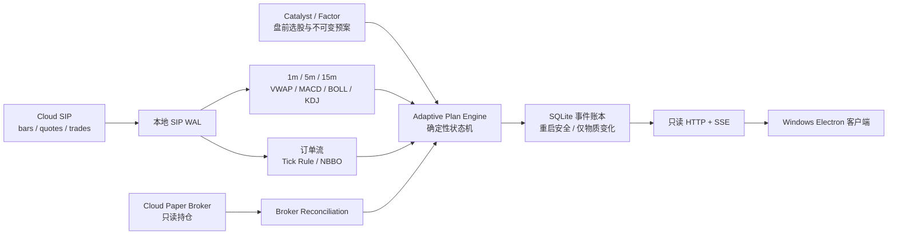

# 自适应日内决策客户端

## 结论

这一版把“选股以后怎么盯、什么时候允许买、什么时候减仓或放弃、当天为何改变预案”
做成了完整的本地客户端闭环。界面不是决策源，Python 确定性内核才是唯一决策源；
客户端只显示事实、状态、原因和事件记录。

当前版本默认只读，`orders_authorized=false`。它不会自动下单，也没有隐藏的下单接口。
这是有意的生产边界：先用真实 SIP 行情和真实 Broker 持仓跑稳，再单独验收执行层。

客户端首页现在先读取不可变的 `kernel.universe.selection_gates`，而不是把“已经注册动态预案”
误当成“今天完成选股”。如果今日锁池失败，它会明确显示失败任务、错误类型、目标交易日，
并把最近一次名单标成历史快照；历史名单不能生成今天的入场许可。复盘页、Agent 页和系统页
同样只展示已持久化的真实证据，不再用静态说明冒充在线状态。

## 运行结构



## 为什么不会每 15 秒乱改预案

轮询频率和预案修订频率被分开处理：

- 每 15 秒读取一次事实，避免错过止损、强制离场和数据失效；
- 同一根已完成 1 分钟 K 线不会重复计数；
- 入场需要两个不同的已完成 1 分钟确认；
- 普通调整默认至少间隔 180 秒，每日最多三次；
- 只有硬止损、强制离场和数据/报价失效可以立即越过普通冷却；
- 保护止损只能收紧，不能向下放宽；
- 侦察仓和加仓数量按剩余风险、剩余名义仓位和冻结的 `probe_fraction` 取最小值；
- 同一券商持仓数量没有变化时，同一条加仓建议不会反复出现；
- 事件账本只记录状态或动作真正变化，15 秒噪声不会刷屏。

这正好对应“根据市场实时调整，但不能太频繁”：行情采样快，策略状态变化慢，风险事件
立即处理。

## 当前使用的证据

每个计划同时读取：

- 标的 1 分钟触发；
- 5 分钟趋势确认；
- 15 分钟趋势确认；
- 当日 VWAP、绿量比、相对 SPY 强度；
- SPY 和行业 ETF 是否站上各自 VWAP；
- 市场 risk-off 状态；
- 最近五分钟逐笔成交与 NBBO 推导的订单流不平衡；
- 盘前冻结的催化剂分数，或纯因子路线；
- Broker 返回的实际数量和实际持仓均价。

缺少任一必要证据时显示 `N/A` 并停止该路径，不用零值代替，不补造缺失 K 线。

## 状态机

主要状态为：

`WATCHING → ARMED → ENTRY_READY → HOLDING → ADD_ALLOWED`

风险分支为：

`REDUCE_REQUIRED / EXIT_REQUIRED / ABANDONED / CLOSED`

客户端显示的动作只有建议性质：

- `ARM_ENTRY`：条件开始聚合；
- `ENTER_PROBE`：侦察仓条件满足，仅作为研究状态；
- `ALLOW_ADD`：持仓后多周期和订单流再次确认，且仍有风险容量，仅作为研究状态；
- `REDUCE`：优势衰减，建议减仓；
- `TIGHTEN_STOP`：结构止损上移；
- `EXIT_NOW`：硬止损或时间止损；
- `ABANDON`：入场窗口结束或证据失效。

## 持仓与重启安全

Broker 是唯一持仓真相源。本地旧文件、上次客户端状态或用户曾经输入的数量都不能覆盖
Broker 返回值。Broker 已经平仓时，重启不会把旧本地持仓复活。

不可变基线、运行状态和事件序列都写入 WAL/FULL SQLite。相同 `plan_id` 不能静默换参数；
修改基线必须创建新计划 ID，从而保留完整审计链。

## 本地启动

首次安装：

```powershell
Set-Location client
npm install
Set-Location ..
```

只查看真实选股、任务账本、复盘和 Agent 健康，不启动行情采集或 Paper 监控：

```powershell
Set-Location client
npm.cmd run desktop
```

这一路径会构建 React 页面、启动仅绑定 `127.0.0.1` 的 Python 只读服务并打开 Electron。
即使 `runs/adaptive-plans.sqlite3` 还没有动态预案，首页仍会显示最近的不可变选股证据及其
是否过期。关闭 Electron 后，它只会停止自己创建的本地只读服务。

需要启动完整的 15 秒行情监控闭环时，再创建当天的不可变预案配置：

从示例创建当天配置：

```powershell
Copy-Item config\adaptive_plans.example.json config\adaptive_plans.local.json
```

需要替换：

- `plan_id`、`symbol`、`trade_date`；
- 入场窗口和 UTC 强制离场时间；
- 初始硬止损、最大风险和最大名义仓位；
- 侦察仓占可用风险容量的比例 `probe_fraction`；
- 对应行业 ETF；
- 来自已接受快照的催化剂分数及 provenance。

启动：

```powershell
.\scripts\start_adaptive_client.ps1 -Config config\adaptive_plans.local.json
```

启动器依次完成：

1. 校验并注册不可变预案；
2. 从云端接口预热最近十个日历日的真实 SIP 分钟线，以及最近十分钟逐笔/报价；
3. 启动 SIP SSE 本地持久化；
4. 启动 15 秒自适应监控；
5. 构建并打开 Windows Electron 客户端。

关闭客户端后，启动器只停止本次自己创建的监控进程。

## 数据和密钥边界

- 客户端包不包含 Alpaca Key、云端 token 或 `.env`；
- 浏览器侧只能读取 `/v1/health`、`/v1/desk`、`/v1/dashboard`、`/v1/events`
  和只读 SSE；
- `/v1/desk` 只返回白名单化字段：不可变选股、盘后复盘、任务状态、Agent 健康和成熟度
  证据，不返回任务 token、密钥或 `.env`；
- 唯一允许的写操作是单向全局急停；它要求客户端专用自定义请求头，跨站表单或普通网页请求无法触发；
- 配置 Bearer 保护时，首页签发随机、HttpOnly、SameSite=Strict 的浏览器会话 Cookie，REST 与 SSE 可继续使用；外部调用仍可使用 Authorization Bearer；
- 本地服务只绑定 loopback；
- VPS 部署必须在认证 HTTPS 网关后，不能把本地只读端口裸露到公网；
- 行情连接由云端平台唯一持有，本地只消费受限接口。

## 当前没有伪装成“已完成”的部分

客户端本身已经形成可验证闭环，但它没有把研究系统自动批准为实盘系统：

- 当天基线配置仍必须来自已接受的盘前选股/技术证据；
- 自动下单继续关闭；
- 自动参数晋级继续由样本量、净成本标签、purged OOS 和人工审批共同约束；
- 第一档止盈事实必须来自可核对的成交/持仓证据；没有该证据时不会假定止盈已经发生；
- Electron 安装包需要在 VPS 认证 API 或 Python 后端打包方案固定后再发行，当前推荐从仓库
  启动，避免发布一个缺少后端的空壳安装包。

下一阶段不是增加更多按钮，而是连续记录真实交易日，检查错误触发、漏触发、状态抖动、
订单流覆盖率和 Broker 对账，再决定是否开放 Paper 执行。
