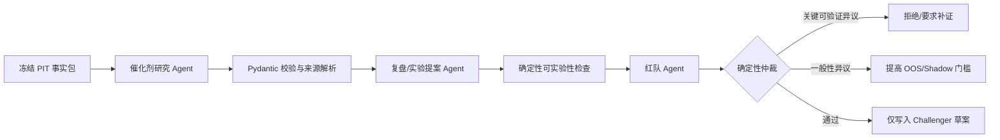

# 量化客户端与多 Agent 后端框架选型

> 调研日期：2026-07-29
>
> 范围：客户端、多 Agent 慢循环、持久化、可观测性与模型供应商替换。
>
> 不在范围：重写确定性选股内核、风控、OMS/EMS 或开放自动实盘。

## 一句话结论

**本系统首选 LangGraph 作为多 Agent 慢循环的显式编排与恢复层；继续使用 Pydantic 作为所有 Agent 输入输出协议，继续保留现有 MCP 网关，DeepSeek V4-Pro 通过独立模型适配器接入。React/Electron 客户端只访问后端 REST/SSE，不安装 Agent SDK，也不持有模型或券商密钥。**

这不是让 LangGraph 接管交易系统。它只编排三类非确定性工作：

1. 催化剂研究 Agent；
2. 复盘/实验提案 Agent；
3. 红队 Agent。

数据事实、PIT 回放、评分、风控、晋级、执行和订单幂等仍由确定性 Python 程序负责。现有工程规则已经明确 `kernel/` 不能调用任何 LLM SDK，这条边界应保持不变。

## 现有工程约束

仓库当前已经具备：

- Python 3.11+、Pydantic 2、严格 mypy、pytest/ruff；
- 官方 MCP Python SDK，以及带角色 allowlist 的 `agent_gateway/`；
- SQLite 作业/事件账本，生产可切 PostgreSQL；
- DeepSeek V4-Pro 的直接 HTTP 适配器和严格 Pydantic 解析；
- React + Vite + Electron 客户端；
- 本地 Python 服务通过 REST + SSE 向客户端提供只读状态；
- Research/Critic 两个只读慢循环 Agent，不能修改生产配置或下单。

因此真正缺少的不是“另建一套 Agent 平台”，而是：

- 可见、可测试的三 Agent 状态图；
- 节点级持久化、失败恢复和人工审查暂停；
- 统一 trace ID、模型调用/工具调用成本与错误追踪；
- 可替换模型适配层；
- 面向客户端的稳定运行状态 API。

## 候选框架比较

| 维度 | OpenAI Agents SDK | Google ADK | LangGraph | PydanticAI |
|---|---|---|---|---|
| Python 与类型 | Python SDK；`output_type` 支持 Pydantic/dataclass/TypedDict | Python 是一等公民；`input_schema`/`output_schema` 支持 Pydantic | Python 一等公民；LangChain Agent 可返回 Pydantic/JSON Schema，图状态可自定义类型 | 类型安全和 Pydantic 输出最强，和本仓库习惯最接近 |
| 工具与 MCP | 函数工具、MCP、托管工具齐全 | 函数、OpenAPI、MCP 和 Google 工具齐全 | Python 工具、LangChain 集成、MCP 可封装为工具节点 | 函数工具、MCP、依赖注入齐全 |
| 多 Agent | 原生 handoff 与 `Agent.as_tool()`，API 简洁 | `sub_agents`、LLM transfer、`AgentTool`、顺序/并行/循环工作流 | 子图、显式节点/边、Supervisor/agent-as-tool 可自行定义 | Agent delegation、程序化 handoff、Pydantic Graph |
| 状态与恢复 | SQLite/Redis/SQLAlchemy Session；`RunState` 可序列化并恢复审批中断 | Session/State/Memory；支持按 invocation 恢复工作流 | 每一步 checkpoint、thread、interrupt、time travel、失败续跑；Postgres/SQLite checkpointer | 消息历史；耐久执行对接 Temporal、DBOS、Prefect、Restate 等运行时 |
| 可观测性 | 内置 LLM/tool/handoff/guardrail trace；可替换 trace processor | logging/metrics/traces、评估和开发 UI 较完整 | LangSmith 体验最好，也可保留本地账本并使用 OTel/自有 tracing | 原生 OTel/Logfire，模型、工具与多 Agent trace 清晰 |
| DeepSeek/供应商替换 | 可用 OpenAI-compatible Chat Completions、自定义 `ModelProvider`；LiteLLM/Any-LLM 适配仍标为 beta | 主要通过 LiteLLM 接 DeepSeek，也支持 Ollama/vLLM 等 | `langchain-deepseek` 有直接集成，工具调用/结构化输出由模型能力配置 | 官方列出 DeepSeek 与大量供应商，可实现自定义模型 |
| 本地/VPS | 轻量库，自行提供 Web 服务和部署 | 自带 CLI、Web、API Server；可本地、Cloud Run/GKE/Google Agent Runtime | 本地库或 Agent Server；可 Docker/VM/VPS，自行控制数据面 | 轻量库，Web/API 与耐久运行时需要自己组合 |
| 与本仓库契合度 | **中高**：简单，但默认心智模型更偏模型驱动 handoff | **中**：功能完整，但会引入较多 ADK 概念和 LiteLLM 依赖 | **最高**：适合明确固定流程、可恢复节点和确定性仲裁 | **高**：类型与模型兼容很好，但耐久图编排需要再选运行时 |

### 官方依据

- OpenAI Agents SDK 的 Agent 支持 tools、handoffs、MCP 和 `output_type`；官方同时提供 [handoff 与 agent-as-tool 两种编排方式](https://openai.github.io/openai-agents-python/multi_agent/)、[Session 持久化](https://openai.github.io/openai-agents-python/sessions/)、[可序列化的 HITL RunState](https://openai.github.io/openai-agents-python/human_in_the_loop/) 和 [可替换 trace processor](https://openai.github.io/openai-agents-python/tracing/)。
- OpenAI 官方说明非 OpenAI 模型可通过 OpenAI-compatible 客户端、自定义 `ModelProvider` 或每 Agent 模型对象接入；Any-LLM/LiteLLM 仍是 best-effort beta，且不同供应商的结构化输出能力并不等价：[Models](https://openai.github.io/openai-agents-python/models/)。
- Google ADK 官方提供 [AgentTool 与 sub-agent 的区别](https://adk.dev/tools/function-tools/)、[Session/State/Memory](https://adk.dev/sessions/)、[工作流恢复](https://adk.dev/runtime/resume/)、[模型连接器与动态路由](https://adk.dev/agents/models/) 及 [部署入口](https://adk.dev/deploy/)。
- Google ADK 通过 LiteLLM 支持 DeepSeek 和本地模型，但官方页面同时披露了 2026-03 的 LiteLLM 供应链事件，若采用必须固定并审计依赖、轮换可能暴露的密钥：[ADK LiteLLM connector](https://adk.dev/agents/models/litellm/)。
- LangGraph 官方定位是长时、有状态 Agent 的低层编排运行时，重点提供 durable execution、streaming、human-in-the-loop 和 persistence：[LangGraph overview](https://docs.langchain.com/oss/python/langgraph/overview)。其 [checkpoint 持久化](https://docs.langchain.com/oss/python/langgraph/persistence) 会在每一步保存状态并支持失败续跑，`interrupt` 可持久暂停等待人工输入：[Interrupts](https://docs.langchain.com/oss/python/langgraph/interrupts)。
- LangGraph 子图可以选择每次调用、每 thread 或无状态模式，适合把三个 Agent 做成隔离的子图：[Subgraphs](https://docs.langchain.com/oss/python/langgraph/use-subgraphs)。LangChain Agent 的结构化输出会在 provider-native 与 tool strategy 之间选择，并执行 schema 验证：[Structured output](https://docs.langchain.com/oss/python/langchain/structured-output)。
- LangChain 有专用 `langchain-deepseek` 包，官方列出的 DeepSeek 集成支持工具调用、结构化输出、流式和异步：[ChatDeepSeek](https://docs.langchain.com/oss/python/integrations/chat/deepseek)。但仍须以 DeepSeek 当前官方模型契约为准。
- PydanticAI 官方支持 Agent delegation、程序化 handoff 和图控制流：[Multi-Agent Patterns](https://pydantic.dev/docs/ai/guides/multi-agent-applications/)；官方仓库同时列出模型无关、MCP、HITL、OTel、durable execution 和结构化流式输出能力：[pydantic-ai](https://github.com/pydantic/pydantic-ai)。

## 为什么最终选 LangGraph

### 1. 我们需要的是“显式流程”，不是 Agent 自由聊天

推荐流程应由代码固定：



LangGraph 的节点、条件边、checkpoint 和 interrupt 正好对应这个工作流。不要让一个“总 Agent”自由决定下一位 Agent，也不要采用多数投票。

### 2. 恢复语义适合盘后任务

每日复盘可能因模型 API、网络、数据库或 VPS 重启而中断。LangGraph 能从已完成 checkpoint 继续，且每个外部写入节点都可以先用现有 job ledger 做幂等检查。

重要边界：**checkpoint 只用于运行恢复，不是审计事实源。** 不可覆盖的决策账本、数据/模型/代码 hash 和 MCP 调用记录仍写入现有 SQLite/PostgreSQL。

### 3. DeepSeek 不必经过新的统一网关

第一版可直接使用 `ChatDeepSeek(model="deepseek-v4-pro")`，避免为一个供应商额外部署 LiteLLM。模型构造必须藏在一个项目内适配器后面，Agent 与图只依赖项目自己的 `ModelPort`/工厂。

DeepSeek 官方说明 V4-Pro 支持 OpenAI Chat Completions 和工具调用；普通 JSON Output 只保证合法 JSON，并可能偶发空内容，严格函数调用仍属于 beta。因此 Production 级处理必须继续执行 Pydantic 验证、重试上限、空内容失败关闭和原始响应审计，不能把 provider 的 JSON 模式当成完整 schema 保证：[DeepSeek V4](https://api-docs.deepseek.com/updates/)、[JSON Output](https://api-docs.deepseek.com/guides/json_mode/)、[Tool Calls](https://api-docs.deepseek.com/guides/tool_calls)。

### 4. 客户端不应该决定框架

Electron 只需要知道后端契约，不需要知道后端是 LangGraph、ADK 还是 OpenAI Agents SDK。这样以后更换 Agent 框架，客户端无须重写。

## 推荐落地边界

### 后端

建议新增独立包（名称仅示意）：

```text
agent_runtime/
  contracts.py          # Pydantic 输入、输出、事件协议
  graph.py              # 固定节点/边，不包含交易执行
  model_provider.py     # DeepSeek/OpenAI/本地模型适配
  nodes/
    catalyst.py
    review.py
    red_team.py
    deterministic_gates.py
  tools.py              # 仅包装现有 MCP allowlist
  checkpoints.py        # 本地 SQLite / VPS PostgreSQL
  tracing.py            # 统一 trace_id 与脱敏策略
```

关键做法：

- Agent 输出继续使用 `extra="forbid"`、frozen Pydantic 模型；
- Agent 只收到冻结的事实引用，不直接打开交易数据库；
- 现有 MCP 服务仍是权限边界，LangGraph 不能绕过 MCP 直接访问 Broker；
- 每个 tool、node 和 LLM call 继承同一 `trace_id`；
- 本地开发用 SQLite checkpointer；VPS 多进程用 PostgreSQL checkpointer；
- 每次运行固定 `workflow_version`、`prompt_version`、`model_id`、`data_hash` 和 `code_hash`；
- 模型切换只发生在 `model_provider.py`，不散落在节点代码中；
- 模型超时、空输出、schema 错误或工具失败均失败关闭，不生成“默认通过”。

### Electron/React 客户端

保留当前 REST + SSE 思路，增加的只是版本化只读资源：

```text
GET /v1/agent-runs
GET /v1/agent-runs/{run_id}
GET /v1/agent-runs/{run_id}/events
GET /v1/challengers
GET /v1/red-team-findings
SSE /v1/agent-runs/{run_id}/stream
```

若未来加入人工审批，再单独设计带认证、CSRF/重放保护和幂等键的命令 API。审批只允许“同意进入下一研究阶段”，不能直接改生产参数或下单。

客户端只展示：

- 当前节点与进度；
- Research 提案；
- 红队反证和证据引用；
- 确定性闸门结果；
- Challenger/Shadow/Paper/Production 状态；
- token、耗时、错误、模型版本和 trace ID。

密钥只放 VPS 环境或密钥管理器；绝不打包进 Electron、SSE payload、日志或 `.env` 模板。

## 分阶段迁移

### 阶段 0：先冻结协议

不引入框架，先把已决定的 Agent 间协议做成版本化 Pydantic：

- `EvidenceClaim`
- `CatalystAssessment`
- `ReviewHypothesis`
- `RedTeamFinding`
- `ExperimentProposal`
- `DeterministicVerdict`

### 阶段 1：只迁移盘后 Research/Critic

把现有 Research/Critic 变成 LangGraph 的两个显式节点，再加红队节点。读取现有冻结事实包，输出仍写现有审计库。新旧路径对照运行，结果不影响 Production。

验收项：

- 相同输入可完整回放；
- 中断后不会重复写提案；
- 模型不可用时只记录失败；
- 无来源事实不能通过；
- 红队关键异议能阻止晋级；
- Agent 层始终没有 Broker 工具。

### 阶段 2：接入客户端

在现有 Python 服务增加只读运行查询与 SSE 事件，把节点状态、证据和红队结论展示出来。先不增加任何写操作。

### 阶段 3：加入催化剂 Agent

仅在盘前/盘后慢循环中使用，输出结构化事件事实和置信度；最终催化剂分仍由经过 OOS 验证的程序模型计算。

### 阶段 4：耐久化与可观测性

- VPS 改用 PostgreSQL checkpoint；
- 保留现有 JSON/SQLite 审计并增加 OTel；
- 需要图形化调试时再评估 LangSmith SaaS；若数据合规不允许外发，则保持本地 trace 或使用自有 OTel 后端；
- 不为了框架引入 Kubernetes。官方 LangSmith 自托管完整版面向企业并依赖较重；单 VPS 阶段没有性价比：[Self-hosted LangSmith](https://docs.langchain.com/langsmith/self-hosted)。

## 其他框架何时更合适

- **OpenAI Agents SDK**：如果将来主要模型变成 OpenAI，流程较短，最看重简洁 handoff/agent-as-tool 和内置 trace，可以重新评估。当前也能接 DeepSeek，但跨供应商功能差异和 beta adapter 需要更多兼容测试。
- **Google ADK**：如果将来全面使用 Gemini/Vertex/Cloud Run，且需要其开发 Web UI、Agent Runtime、A2A 和 Google 工具生态，ADK 会更合适。当前单 VPS + DeepSeek 下没有明显收益。
- **PydanticAI**：如果最终发现工作流并不复杂、主要诉求是最强类型安全、直接 DeepSeek、OTel 与简单的程序化 Agent handoff，它是很好的轻量备选；但不要同时引入 PydanticAI 和 LangGraph 两套 Agent 循环。

## 不应采用的做法

- 不把 Agent SDK 引入 `kernel/`；
- 不让三个 Agent 投票决定买卖；
- 不让 Agent 直接修改因子、权重、风控或订单；
- 不把 Agent checkpoint 当交易审计账本；
- 不在 Electron 内直接调用 DeepSeek/OpenAI；
- 不把 API key 放客户端；
- 不把框架自带“memory”当作可验证事实；
- 不在第一版同时部署 LangGraph、ADK、OpenAI Agents SDK 和 PydanticAI；
- 不用动态 handoff 替代确定性的节点和条件边；
- 不因 Agent 输出合法 JSON 就跳过 Pydantic 校验与来源核验。

## 最终建议

**现在用 LangGraph，但只用它最有价值的四项能力：显式状态图、checkpoint、interrupt、streaming。**

现有 Pydantic、MCP、SQLite/PostgreSQL、DeepSeek 适配器和 Electron 客户端全部保留。先迁移盘后 Research/Critic 并加入红队，不触碰盘中确定性内核。等这一条链路通过恢复、幂等、trace、成本和安全测试后，再让客户端展示 Agent 运行状态。

这条路线既能实现真正的多 Agent 自动复盘与进化，又不会把交易系统变成不可审计的“Agent 自由聊天系统”。
