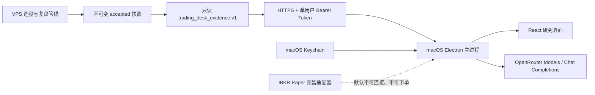

# macOS 研究分析版客户端

## 定位

这是给外部研究用户的独立客户端，不是本地交易终端的移植版。

它只提供：

- 当日不可变选股名单与证据；
- OpenRouter 驱动的研究答疑；
- 盘后强势股、漏选原因和因子缺口复盘；
- 催化剂、红队、证据审计三个只读 Agent；
- 独立的答疑模型和三个 Agent 模型配置。

它明确不提供：

- Alpaca Paper、IBKR Paper 或其他模拟盘；
- 持仓、买入、卖出、止盈、止损和急停按钮；
- 实盘连接；
- 任何订单路由。

客户端只接受 `stage=research_only` 且 `orders_authorized=false` 的
`trading_desk_evidence.v1`。远程服务如果返回可执行状态，客户端会拒绝加载。

## 架构



选股和复盘来自服务器，不依赖 Mac 用户拥有 Massive、Alpaca 或本地 Python 环境。
OpenRouter Key 只用于用户自己的答疑和 Agent 调用，不会发送到选股服务器。

## 首次启动

首次打开分两步：

1. 填写研究数据服务地址、该用户的只读访问令牌和自己的 OpenRouter API Key；
2. 分别选择答疑、催化剂 Agent、红队 Agent、证据审计 Agent 使用的模型。

四个模型可以相同，也可以完全不同。模型目录来自 OpenRouter 官方
`GET /api/v1/models?output_modalities=text`。答疑和 Agent 使用官方
`POST /api/v1/chat/completions`，当前采用非流式响应，方便记录确切模型和 token 用量。

OpenRouter Key 与数据访问令牌由 Electron `safeStorage` 加密保存。在 macOS 上，
`safeStorage` 使用系统 Keychain。渲染进程只能看到“已配置/未配置”，拿不到明文。
如果系统安全存储不可用，客户端拒绝保存，不会降级为明文文件。

## 配置发布时的默认数据地址

发布前可编辑：

`client/analyst-distribution.json`

```json
{
  "schema_version": "macos-research-distribution.v1",
  "default_data_service_url": "https://research.example.com"
}
```

这个文件只能包含公开的 HTTPS 服务地址，不能包含访问令牌、OpenRouter Key 或其他凭据。
配置后，Mac 用户首次启动只需确认地址并填写两个属于自己的凭据。

## 启动只读数据服务

服务器继续只绑定 loopback，由 Nginx/Caddy/Cloudflare Tunnel 等认证 HTTPS 网关代理，
不能把 Python 端口直接暴露到公网。

在 VPS 为该 Mac 用户生成独立的高熵只读令牌，并通过环境变量注入：

```bash
export MACOS_ANALYST_ACCESS_TOKEN='<user-specific-read-token>'
.venv/bin/python -m scripts.serve_adaptive_client \
  --host 127.0.0.1 \
  --port 8787 \
  --static-root client/dist \
  --bearer-token-env MACOS_ANALYST_ACCESS_TOKEN
```

网关必须：

- 终止 TLS；
- 原样转发 `Authorization: Bearer ...`；
- 只代理必要的 `/v1/desk` 和 `/v1/health`；
- 设置请求频率与连接数限制；
- 不记录 Authorization 请求头；
- 不提供 `.env`、`runs`、`data` 或文件目录访问。

后端采用常量时间比较令牌，401 响应不会回显令牌。每个用户应使用独立令牌，以便单独吊销。

## OpenRouter 模型与答疑边界

答疑会附带白名单化后的当日选股、盘后复盘、任务和成熟度摘要。系统提示固定要求：

- 先说明证据日期以及是否过期；
- 不把候选名单当作买入指令；
- 不承诺收益；
- 不补造新闻或缺失数据；
- 证据不足时明确回答不知道。

三个 Agent 的输出同样只是解释和审计，不会写入服务器快照、修改选股阈值或触发订单。

OpenRouter 官方接口：

- <https://openrouter.ai/docs/api/api-reference/models/get-models>
- <https://openrouter.ai/docs/api/api-reference/chat/send-chat-completion-request>

## IBKR Paper 预留接口

预留代码位于：

`client/electron/analyst/ibkr-paper.cjs`

当前状态固定为：

```json
{
  "adapter": "ibkr-paper-reserved.v1",
  "configured": false,
  "connected": false,
  "orderSubmissionEnabled": false
}
```

`connect()` 和 `placeOrder()` 都会失败。后续接入时优先支持 Mac 本机运行的
IBKR Client Portal Gateway 或 TWS/IB Gateway Paper：

- Client Portal Gateway 默认 `https://localhost:5000/v1/api`，需要 Paper 专用用户名、
  2FA 和持续会话维护；
- TWS Paper 默认端口 7497，IB Gateway Paper 默认端口 4002；
- 连接、账户核对、订单意图、幂等键、成交对账和恢复测试必须单独验收；
- 研究版 UI 在验收前不能出现订单控件。

IBKR 官方资料：

- <https://ibkrcampus.com/campus/ibkr-api-page/cpapi-v1/>
- <https://ibkrcampus.com/campus/ibkr-api-page/twsapi-doc/>

## 本地开发与测试

```powershell
Set-Location client
npm ci
npm run test:electron
npm run desktop:analyst
```

`desktop:analyst` 使用独立的 `electron/analyst-main.cjs`，不会启动本地 Paper 监控。

## macOS 构建

macOS 包必须在 macOS runner 上生成：

```bash
cd client
npm ci
npm run dist:mac:analyst
```

仓库内的 `.github/workflows/macos-research-client.yml` 会生成 Intel 与 Apple Silicon 的
DMG/ZIP。默认 CI 产物未签名，仅用于工程验收。

交付真实用户前还需要：

1. Apple Developer ID Application 证书；
2. Apple Team ID；
3. notarization 使用的 App Store Connect API Key 或受控的签名凭据；
4. 签名、notarization、stapling 和另一台干净 Mac 的 Gatekeeper 验收。

没有这些证明时不能把 unsigned DMG 描述成正式生产发行版。
