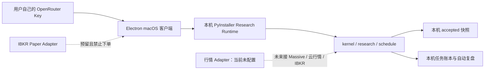

# macOS 本地研究版客户端

## 定位

这个发行版复制主系统的本地研究模式，而不是远程选股结果查看器。

Mac 本机负责：

- 运行 `trading-system-v2` 的确定性选股内核；
- 运行催化剂、纯因子、订单流与统一仲裁研究管线；
- 保存不可变 accepted 数据快照、任务账本和复盘结果；
- 运行收盘漏选归因与结构化复盘；
- 调用用户自己的 OpenRouter Key 完成答疑和三个只读 Agent。

它明确不包含：

- Alpaca Paper 或其他模拟盘；
- 持仓、买入、卖出、止盈、止损和急停按钮；
- 实盘连接或订单路由。

IBKR Paper 只保留 fail-closed 的 Adapter 位置。行情 Adapter 当前为空，
所以首次发布会明确显示 `market_data_provider_unconfigured`，不会下载数据，
也不会用历史名单或测试数据伪造今日选股。

## 架构



Electron 启动时会拉起随 App 分发的原生 Python sidecar。sidecar 只绑定随机
loopback 端口，Electron 为每次启动生成 256-bit 临时令牌；令牌不落盘、不进日志。
本地接口只提供：

- `GET /v1/health`
- `GET /v1/desk`
- `POST /v1/run-due`

其他 POST 路由统一返回 404，不存在订单端点。

## 本地文件

App 的用户目录内维护两个互相分离的目录：

```text
~/Library/Application Support/AI量化研究台/
├── research-data/       # accepted / quarantined 快照
├── research-runs/       # jobs.sqlite3、锁、复盘与成熟度证据
└── research-settings.json
```

`research-settings.json` 只保存模型 ID 和密文。OpenRouter Key 由 Electron
`safeStorage` 使用 macOS Keychain 加密；渲染进程只能看到“已配置”状态。

## 首次启动

首次打开分两步：

1. 本地研究内核启动自检，用户填写自己的 OpenRouter API Key；
2. 分别为答疑、催化剂 Agent、红队 Agent和证据审计 Agent 选择模型。

不再要求公网选股服务地址或数据访问令牌。

OpenRouter Key 只负责模型调用，不能替代行情源。行情 Adapter 未配置期间：

- 本地内核和自动调度仍正常启动；
- 选股状态固定为阻断；
- 复盘只展示本机已有、可验证且带日期的 accepted 证据；
- 三个 Agent 必须说明行情缺失，不能产生买卖建议或虚构今日名单。

## 行情 Adapter seam

代码 seam 位于：

- `operations/local_research_runtime.py`
- `MarketDataAdapter`

现有两个 Adapter：

1. `UnconfiguredMarketDataAdapter`：默认启用，永远 fail-closed；
2. `EnvironmentMarketDataAdapter`：兼容当前 Massive 加云行情管线，但发行版
   尚未提供配置入口，也不会自动启用。

以后接 Massive、Alpaca、IBKR 或团队行情接口时，只需新增/启用 Adapter；
Electron、选股内核、复盘和 Agent 界面无需重写。

当前兼容 Adapter 要求：

```text
MASSIVE_API_KEY
CLOUD_PLATFORM_BASE_URL
CLOUD_MARKET_DATA_API_TOKEN
SEC_USER_AGENT
```

状态接口只返回缺少的变量名称，永远不返回变量值。

## 自动执行

sidecar 每 60 秒调用一次深模块 `ScheduledResearchPipeline.run_due()`。
这个接口隐藏完整的盘前与盘后 DAG，内部复用：

- `schedule.premarket`
- `schedule.postmarket`
- 既有 `data_plane/`、`kernel/`、`research/` 和 `scripts/`

任务账本、进程锁和 accepted 快照保证重复轮询幂等。行情未配置时调用在
进入任何下载或计算任务前被阻断，`orders_submitted` 始终为 0。

## OpenRouter 与三个 Agent

四个模型角色相互独立：

- 研究答疑；
- 催化剂 Agent；
- 红队 Agent；
- 证据审计 Agent。

模型目录来自 OpenRouter 官方
`GET /api/v1/models?output_modalities=text`，回答使用
`POST /api/v1/chat/completions`。所有模型请求都由 Electron 主进程发出。

官方资料：

- <https://openrouter.ai/docs/api/api-reference/models/get-models>
- <https://openrouter.ai/docs/api/api-reference/chat/send-chat-completion-request>

## IBKR Paper 预留

预留代码位于：

`client/electron/analyst/ibkr-paper.cjs`

`connect()` 与 `placeOrder()` 当前都会失败。后续接入必须单独完成账户核对、
幂等订单、成交对账、断线恢复和 Paper 前向验收，验收前研究版 UI 不出现订单控件。

IBKR 官方资料：

- <https://ibkrcampus.com/campus/ibkr-api-page/cpapi-v1/>
- <https://ibkrcampus.com/campus/ibkr-api-page/twsapi-doc/>

## 本地开发

```powershell
Set-Location client
npm ci
npm run test:electron
npm run desktop:analyst
```

开发模式使用仓库 `.venv`。Electron 启动和关闭时会共同管理本地 sidecar，
不会启动 Paper 监控。

## macOS 自包含构建

CI 在 ARM64 与 Intel 原生 runner 上分别构建 PyInstaller sidecar，再由
Electron Builder 生成对应架构的 DMG/ZIP：

```bash
python -m pip install -r requirements-macos-research.txt
cd client
npm ci
npm run build
npm run test:electron
npm run icon:mac
npm run runtime:mac
npx electron-builder --config electron-builder.analyst.yml --mac dmg zip --arm64
```

GitHub workflow：

`.github/workflows/macos-research-client.yml`

默认 CI 产物未签名，只用于工程验收。正式交付仍需要 Developer ID Application
签名、notarization、stapling 和另一台干净 Mac 的 Gatekeeper 验收。
