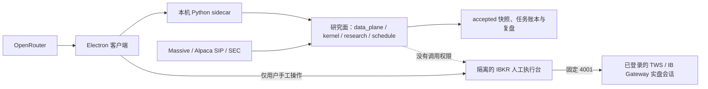

# macOS 本地研究客户端

## 定位

macOS 版与 Windows 版使用同一套研究与交互代码，不是远程结果查看器。Mac 本机负责：

- 增量同步 Massive、Alpaca SIP 和 SEC 研究输入；
- 运行催化剂、纯因子、订单流、统一仲裁与确定性选股；
- 运行盘中监控、证据答疑、三个只读研究 Agent 和收盘复盘；
- 保存 accepted 快照、任务账本、复盘记录和执行账本；
- 在独立页面提供人工 IBKR 实盘执行台。

这仍是工程验证版本，不应称为已经完全成熟的交易产品。研究结果不构成收益保证，用户
仍需在 TWS / IB Gateway 中独立核对账户、挂单和成交。

## 两个严格隔离的平面



研究面始终保持 `orders_authorized=false`。选股、监控、自动复盘、答疑和 Agent 只能
生成研究证据，不能构造或提交 IBKR 指令。人工执行台使用独立命令入口、独立状态机和
SQLite 幂等账本；它不会被定时任务、研究结果或模型输出自动触发。

## 研究能力与数据

固定 Alpaca SIP 代理提供实时 quote、trade 和 minute bar。Massive 提供历史日线与
新闻，SEC 联系信息用于合规访问公开申报数据。缺少历史、新闻、财务或实时证据时，
对应流程会显示明确阻断原因，不会用旧名单、测试数据或补值生成新的确定性结论。

发行包必须携带经过哈希校验的 `research-bootstrap.zip`。首次运行会把 bootstrap 中的
accepted 存量快照复制到用户数据目录，之后只同步增量。bootstrap 不包含 API Key，
缺失或校验失败会让打包过程直接停止。盘前分钟历史不在 bootstrap 中；今日选股会按
锁定候选和最近 20 个历史会话从 Alpaca 代理下载，并复用本机缓存。

## 首次启动

1. 打开安装后的 App，填写自己的 OpenRouter Key、Massive Key、Alpaca SIP 代理
   Key/Secret 和 SEC 联系信息。
2. 完成连接验证，为研究答疑、催化剂、红队和证据监督角色选择模型。
3. 在“数据源状态”确认 bootstrap 已加载，再运行“同步数据”。
4. 点击“运行今日选股”；流程会先增量同步，再构建选股快照，并在满足条件时启动盘中
   监控。
5. 收盘后运行复盘；答疑和 Agent 只引用带时间、日期和过期标记的本机证据。

OpenRouter Key 只负责模型调用，不能替代行情或研究数据。所有凭据均由 Electron 主
进程读取，不会写死在源码或安装包中。

## 人工 IBKR 实盘执行

人工执行台只连接已经登录的 TWS 或 IB Gateway，端口固定为实盘 `4001`。应用不接收
也不保存 IBKR 用户名和密码。

首次使用：

1. 在 TWS / IB Gateway 中启用 Socket API，确认实盘 API 端口为 `4001`。
2. 在客户端设置页填写主机、Client ID 和单笔最大名义金额；通常主机为
   `127.0.0.1`。
3. 打开交易页的实盘总开关。启动或重启客户端后该开关始终默认为关闭。
4. 首次连接时，程序读取 TWS 可见账户。只有一个账户可见时才能进入首次绑定；多个
   账户会失败关闭，不能自动挑选其中一个。
5. 核对脱敏账户并输入绑定确认文字。完整账户 ID 由主进程通过系统安全存储加密保存，
   后续连接必须严格匹配。
6. 重新连接，输入临时写权限确认文字；写权限有短时有效期，并在提交一次、断开或重启
   后关闭。
7. 手工填写股票、方向、股数和限价，生成预览。预览会先调用 IBKR What-If，并显示
   佣金、保证金变化和警告。
8. 再次核对 `OpenLong` 或 `ReduceLong`、股数、限价和账户脱敏值，输入动态确认文字
   后才可提交。

执行台只接受：

- `OpenLong`：开多；
- `ReduceLong`：减多或平多，且会核对当前多头持仓及未完成卖单；
- `STK / SMART / USD`；
- `DAY LMT` 限价单。

每次预览和提交都会重新核对账户证据。单笔名义金额超过配置上限时失败关闭；同一标的
已有活动买单时不会继续创建第二笔开多。客户端订单号、IBKR `orderRef` 和本机 SQLite
账本共同提供幂等保护。若提交响应超时或状态无法确定，记录会进入 `unknown`，整个新单
流程进入 `recovery_required`；用户必须先运行“核对未知订单”，系统不会盲目重发。

详细边界和排错见 [IBKR 人工实盘执行台](IBKR_LIVE_EXECUTION.md)。

## 必须知道的限制

当前客户端不支持：

- IBKR 模拟盘或端口 `4002`；
- 卖空、期权、期货、外汇或其他资产；
- 市价单、盘前盘后单、GTC、括号单和自动止盈止损；
- 由选股、Agent、监控或复盘自动下单；
- 在客户端修改或撤销已经提交的订单；
- 自动处理多个 IBKR 账户。

关闭实盘总开关、退出客户端、修改配置或清除账户绑定，只会禁止新委托并断开 API。
这些操作**不会撤销已经到达 IBKR 的订单**。提交过订单后，必须在 TWS / IB Gateway
核对其最终状态；需要撤单时也必须在官方客户端完成。

## 本地文件与安全

```text
~/Library/Application Support/AI量化研究台/
├── research-data/          # accepted / quarantined 快照
├── research-runs/          # jobs.sqlite3、执行账本、锁、复盘与成熟度证据
└── research-settings.json  # 模型 ID、公开状态和系统安全存储密文
```

OpenRouter、Massive、Alpaca 和 IBKR 账户绑定信息由 Electron `safeStorage` 使用
macOS Keychain 加密。渲染进程只能接收白名单字段和脱敏账户值。本地 sidecar 只绑定
随机 loopback 端口，并使用每次启动重新生成、不会落盘的临时 Bearer Token。

研究 HTTP 路由与人工执行路由共用本地 sidecar，但权限边界不同。执行相关接口只有：

- `GET /v1/execution`：读取脱敏执行状态；
- `POST /v1/execution/commands`：接受经过主进程白名单校验的人工命令。

不能把 `.env`、`quant.env`、Key、`research-settings.json` 或包含账户信息的执行数据库
提交到 Git 或打进公开安装包。

## 常见连接问题

- 连接 `4001` 失败：确认打开的是实盘 TWS / IB Gateway、Socket API 已启用、端口确实
  为 `4001`，主机和 Client ID 正确，并检查防火墙与 TWS 的受信任 IP 设置。
- `502`：通常表示无法连接 TWS / IB Gateway。先确认官方客户端已登录并完成所有弹窗，
  再核对端口和 API 设置；不要反复点击提交。
- `2107`：表示 IBKR 历史数据通道正在待命，发起历史请求时会自动连接。它与安装包预置
  的 Massive 本地历史库是两条独立链路；适配器把它视为信息，不等于缺少历史数据或
  订单被拒绝。仍应结合连接状态和后续明确错误判断。
- `multiple_accounts_require_selection`：TWS 暴露了多个账户，当前版本会失败关闭；请勿
  猜测或让程序自动选第一个账户。
- `recovery_required`：存在提交结果不确定的订单。先在 TWS 核对，再使用客户端恢复
  功能；不要创建新客户端订单号绕过。

## 本地开发

```bash
cd client
npm ci
npm run test:electron
npm run test:ui
npm run desktop:analyst
```

开发模式使用仓库 `.venv`。Electron 启动和关闭时管理本地 sidecar，但关闭 sidecar
不会撤销券商挂单。

## Apple Silicon 自包含构建

当前发布流程只构建 Apple Silicon（M 系列）版本。构建前必须准备 bootstrap：

```bash
python3.12 -m venv .venv
source .venv/bin/activate
python -m pip install -r requirements-macos-research.txt
cd client
npm ci
BOOTSTRAP_ARCHIVE=/absolute/path/research-bootstrap.zip \
  npm run dist:mac:analyst -- --arm64
```

输出位于 `client/release-macos-analyst/`。测试产物默认未做 Developer ID 签名、
notarization 和 stapling，只适合工程验收；正式分发前仍需完成签名、公证和另一台干净
Mac 的 Gatekeeper 验收。跨平台完整命令见
[客户端构建说明](CROSS_PLATFORM_DESKTOP_BUILD.md)。
