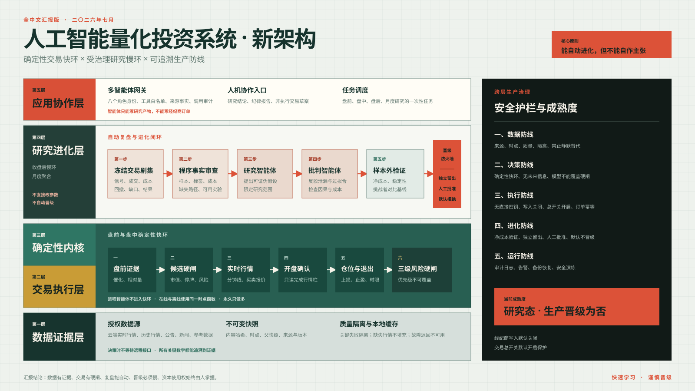

# 人工智能量化投资系统新架构汇报

> 汇报核心：这不是一套让大模型直接炒股的系统，而是一套以确定性程序完成选股、风控和交易，以多智能体完成复盘、质疑和研究提案的可审计量化系统。



## 一、架构升级解决了什么问题

旧式量化系统常见的两个极端是：

1. 所有逻辑都写死在策略代码里，能够稳定运行，但很难自动吸收新的市场经验。
2. 把选股和交易交给大模型，适应性看似更强，但存在不可复现、不可审计和越权交易风险。

新架构采用“双闭环”：

- **确定性交易快环**负责盘前选股、盘中确认、仓位、退出、风控和订单状态。
- **受治理研究慢环**负责盘后复盘、提出假设、反驳假设、样本外验证和经验沉淀。
- 两者之间设置**晋级防火墙**。研究结论不能自动进入生产，更不能自动动用资金。

因此系统可以持续学习，但不会自行修改生产规则或绕过风控。

## 二、五层架构

### 第一层：数据证据层

负责接入、固化和验证所有外部数据。

主要能力：

- 接入云端实时行情、历史行情、公告、新闻和参考数据。
- 每份数据固化为不可变快照，记录内容哈希、版本、时点、父快照和来源。
- 关键质量检查失败的数据自动隔离，不允许进入特征、回测、模型或交易。
- 缺失或停牌分钟不做填充，避免制造不存在的可交易性。
- 云端数据故障时返回“不可用”，不静默切换到未经验证的社区数据。
- 实时决策读取本地点时缓存，不在决策路径中等待远程接口。

对应工程边界：

- `data_plane/`
- `db/`
- `execution/sip_store.py`
- `data/accepted` 与隔离快照

### 第二层：交易执行层

负责把经过验证的交易意图转换为可恢复、可追溯的订单状态。

主要能力：

- 交易计划永久只做多。
- 每个计划必须绑定不可变的选股快照和实时事件编号。
- 强制包含止损、止盈和时间退出。
- 风控按一级、二级、三级硬闸顺序裁决，模型分数不能覆盖硬闸。
- 订单使用确定性的客户订单编号，系统重启后不会重复下单。
- 订单管理记录完整状态转换、成交、经纪商订单编号和恢复对账结果。

对应工程边界：

- `execution/`
- `kernel/tradeplan.py`
- `kernel/guardrails.py`
- `kernel/sizing.py`
- `kernel/exits.py`

### 第三层：确定性策略内核

负责每天真正影响选股和交易决策的快环。

盘前流程：

1. 解析财报、公告和新闻催化剂。
2. 计算盘前相对成交量和价格方向。
3. 检查市值、流通股、停牌、异常波动、财报日和前一日放量下跌。
4. 形成带来源、时点和拒绝原因的锁定候选池。

盘中流程：

1. 读取实时分钟行情和买卖报价。
2. 等待开盘区间完成。
3. 使用已完成行情柱生成开盘突破意图。
4. 结合一分钟、五分钟、十五分钟结构进行风险观察。
5. 计算账户感知仓位、止损、止盈和时间退出。
6. 通过三级风控后形成交易计划。

快环的关键原则：

- 不调用大模型。
- 不读取未来行情。
- 不等待远程特征接口。
- 在线和离线使用同一套时点函数。
- 缺失数据时停止该路径，而不是猜测。

对应工程边界：

- `kernel/catalysts.py`
- `kernel/universe.py`
- `kernel/signals.py`
- `kernel/technical_monitor.py`
- `kernel/features/`

### 第四层：研究进化层

负责自动复盘与受治理的策略进化。

完整流程：

1. **冻结交易剧集**：将选股、信号、行情路径、成交、成本、最大有利波动、
   最大不利波动和缺失数据固化。

2. **程序事实审查**：先由确定性程序核对样本数量、成本覆盖、标签可用性、
   数据缺口和允许实验范围。

3. **研究智能体提出假设**：只能提出零到五条可证伪的研究假设，不能修改
   代码或下单。

4. **批判智能体反驳**：专门检查未来信息泄漏、过拟合、错误因果、缺少成本
   和证据不足。

5. **结构化复盘与经验沉淀**：形成纪律报告、匿名经验和研究草案，避免记忆
   某只股票代码。

6. **样本外沙盒验证**：使用时间隔离的净化样本外验证，比较挑战者与现有
   基线，并保留独立留出集。

7. **人工晋级**：即使研究候选胜出，也只能成为待审批的新冠军；生产晋级
   默认关闭。

对应工程边界：

- `research/program_review.py`
- `research/postmortem_agents.py`
- `research/pdca_agents.py`
- `research/evolution.py`
- `research/sandbox.py`
- `research/validation.py`

## 三、多智能体到底怎么用

系统存在八个受权限约束的智能体角色：

| 角色 | 主要职责 | 明确禁止 |
|---|---|---|
| 总控角色 | 汇总研究事实、预览仓位与退出、形成非执行草案 | 直接提交真实订单 |
| 风险角色 | 检查动量、流动性、订单流、空头风险与情绪 | 越过硬风控 |
| 因子发现角色 | 分析动量和流动性因子 | 修改生产因子 |
| 订单流角色 | 分析订单流事实 | 访问经纪商写接口 |
| 空头风险角色 | 识别做多交易的空头风险 | 建立做空分支 |
| 情绪角色 | 分析已固化的情绪证据 | 用无来源文本替代事实 |
| 纪律角色 | 输出交易纪律审计报告 | 修改订单或配置 |
| 复盘进化角色 | 写匿名经验与研究提案 | 批准自己进入生产 |

需要特别说明：

- 这八个角色是**权限边界**，不是八个智能体同时指挥交易。
- 自动盘后主流程仍以“研究智能体＋批判智能体”的双角色审查为核心。
- 每次工具调用都记录请求、结果、角色和失败原因。
- 所有关键数字必须带来源；没有证据时只能返回“不可用”。

## 四、自动进化为什么不会失控

系统没有采用“智能体自动改代码”的方式。

自动进化的真实含义是：

```text
真实交易剧集
→ 程序事实审查
→ 研究智能体提出假设
→ 批判智能体反驳
→ 生成受限实验
→ 净成本样本外验证
→ 挑战者与基线比较
→ 人工批准
→ 才可能形成新的生产版本
```

关键限制：

- 智能体提案永远处于草案状态。
- 智能体输出的生产资格永远为否。
- 样本不足、成本缺失或存在数据缺口时，流程停止推进。
- 新规则必须接受独立留出验证。
- 没有人工批准，研究结果不能进入生产内核。

## 五、四道生产安全防线

### 数据防线

- 来源和时点必须明确。
- 关键质量失败自动隔离。
- 缺失行情不填充。
- 未授权数据不能成为收益证据。

### 决策防线

- 快环完全确定性。
- 禁止未来信息。
- 模型不能覆盖硬风控。
- 云端故障时停止对应决策路径。

### 执行防线

- 本地智能体不持有行情和经纪商原始密钥。
- 经纪商写入默认关闭。
- 交易总开关默认处于保护状态。
- 订单编号幂等，重启恢复不重复下单。

### 晋级防线

- 自动训练不等于自动晋级。
- 必须完成净成本样本外验证。
- 必须保留独立留出集。
- 必须具备人工批准与外部证明。

## 六、当前成熟度

当前系统应继续标记为：

> **研究态，生产晋级为否。**

已经具备：

- 点时数据快照和质量隔离。
- 盘前催化剂、相对成交量和硬闸选股。
- 开盘突破和多周期技术观察。
- 永久只做多的交易计划。
- 三级风险裁决。
- 幂等订单管理和恢复对账。
- 多智能体权限网关。
- 自动盘后复盘和受治理研究提案。
- 沙盒挑战者验证框架。
- 调度、日志、备份、安全演练和成熟度检查。

仍需积累：

- 足够多的独立真实交易日和交易剧集。
- 完整的真实报价成本与净收益标签。
- 稳定的净化样本外验证结果。
- 足够的完整纸面交易会话。
- 告警送达、凭证轮换、风险限额、合规审查等外部证明。

## 七、与传统量化系统相比的核心差异

| 维度 | 传统脚本式量化 | 无约束大模型交易 | 当前新架构 |
|---|---|---|---|
| 实时决策 | 确定性 | 不稳定、难复现 | 确定性 |
| 自动复盘 | 弱 | 强但不可控 | 强且受治理 |
| 数据来源 | 容易分散 | 容易混入无来源信息 | 强制来源与时点 |
| 策略进化 | 主要靠人工改代码 | 可能自动越权 | 自动提出、程序验证、人工晋级 |
| 风控 | 规则化 | 可能被模型解释覆盖 | 硬闸不可覆盖 |
| 订单恢复 | 常被忽略 | 通常不具备 | 幂等订单与恢复对账 |
| 生产权限 | 由脚本配置决定 | 容易混淆研究与执行 | 多重写保护与成熟度闸门 |

## 八、三分钟汇报讲稿

各位好，这次架构升级的核心，不是简单增加几个智能体，而是把系统拆成了两个职责完全不同的闭环。

第一个是确定性交易快环。它负责每天真正影响资金的部分，包括盘前催化剂解析、相对成交量、候选硬闸、实时行情、开盘突破、仓位退出、三级风控和订单状态。这个环节不调用大模型，不读取未来数据，也不等待远程接口，所以每一次决策都能复现和追溯。

第二个是受治理研究慢环。收盘后，系统先冻结真实交易剧集，再由程序检查样本、成本、标签和数据缺口。只有事实条件通过，研究智能体才能提出可证伪假设，批判智能体再从未来信息泄漏、过拟合、错误因果和缺少成本等角度进行反驳。通过后的假设也只能进入样本外沙盒，不能直接改变生产规则。

两个闭环之间有一道晋级防火墙。任何新规则都必须经过净成本验证、独立留出集和人工批准。智能体不能修改生产内核，不能批准自己晋级，也不能直接下单。

整个系统的底座是不可变数据快照和质量隔离；上层还有经纪商写入关闭、交易总开关、幂等订单、备份恢复和成熟度检查等生产防线。

因此这套系统的核心优势是：它能够持续吸收真实交易经验，但资本使用权、生产晋级权和最终风险控制权始终掌握在人手中。

目前系统仍处于研究态。接下来重点不是继续堆功能，而是积累真实交易日、完整成本标签、样本外验证和运行证明，逐步满足纸面交易和生产晋级条件。

## 九、一句话结论

> 新架构把“智能体的适应能力”和“确定性程序的可靠性”结合起来：快速学习，谨慎晋级，所有交易都必须经过可追溯证据和不可绕过的安全闸门。
